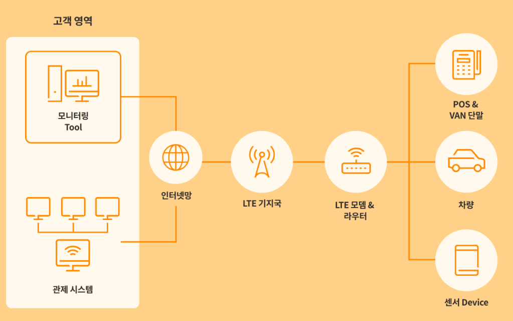
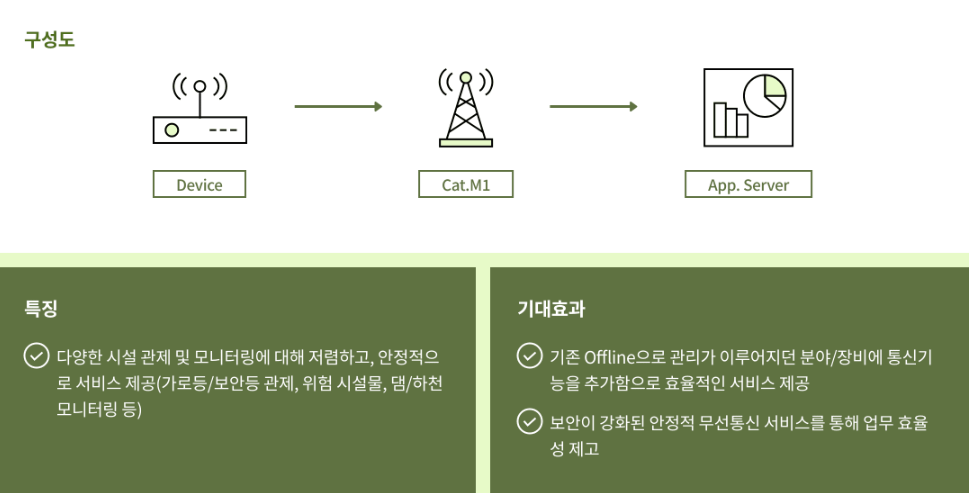
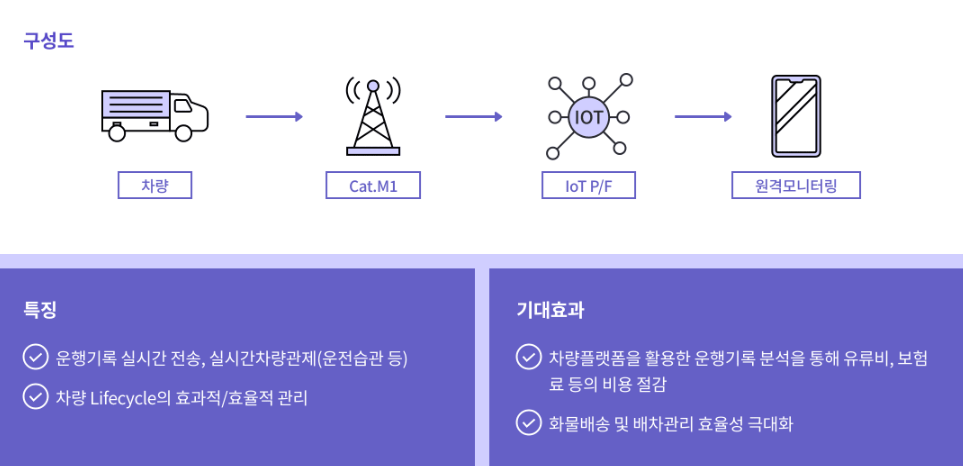

### SK텔레콤 IoT 통신
SK텔레콤은 다양한 IoT 기술을 제공하고 있습니다. 그 중에서도 LoRa, LTE Cat M1, LTE, 5G는 대표적인 IoT 통신 기술로 알려져 있습니다. SK텔레콤이 제공하는 각각의 IoT 기술의 특징을 비교해보도록 하겠습니다.

### LPWA(Cat. M1, LoRa)
------------
**LoRa**(Long Range)는 저전력 광대역 무선 기술로, 대규모 센서 네트워크에서 사용됩니다. 무선 통신 기술 중에서는 특히 저전력 통신 기술로 유명합니다. LoRa는 Long Range Wide Area Network의 약자이고, 저전력/저용량 데이터 전송에 적합한 네트워크 입니다.   
SK텔레콤은 IoT 교두보를 마련하기 위해서 2016년 로라(LoRa) 전국망을 상용화하여, 고효율 IoT 생태계를 만들어가고 있습니다.   
  
**LTE Cat. M1**(Category M1)은 대용량 데이터 전송 및 저전력 모드(Low Power Wide Area, LPWA)를 지원하는 IoT 기술입니다. LoRa와 Cat. M1은 주로, 가스/수도/전력 사용량 자동 SK텔레콤은 2018년 4월 LTE Cat.M1 전국망 완성을 통해서, IoT 제조사들의 다양한 수요에 대응할 수 있는 네트워크 포트폴리오를 확보하고 IoT 생태계의 기반을 마련하였습니다.   

**특징**
+ **저렴한 요금제** : 저전력 소모 및 대규모 센서 네트워크를 지원하여 비용 절감 효과를 가져옵니다.
+ **저전력 소모** : 전송 속도가 느리지만, 매우 낮은 전력으로 데이터를 전송할 수 있습니다.
+ **안정적인 서비스** : 기 점증된 SK텔레콤의 안정적인 통신 인프라를 이용한 안정적인 전국망 서비스를 제공합니다.

### LTE/5G
SK텔레콤의 LTE/5G 기술은 최대 20Gbps의 속도(체감 속도 1Gbps)를 지원하고, 고속 이동 중에도 안정적인 통신을 할 수 있습니다. 
이런 안정적이고, 고속 데이터 통신을 이용하여, 차량, 결제, HD-CCTV, 자율 주행, AI 등 다양한 서비스를 구현하실 수 있습니다.

**특징**
- **안정적인 서비스** : 37만개 이상의 LTE 기지국을 이용하여 안정적인 LTE/5G 통신 서비스를 이용합니다.
- **초고속 서비스** : HD CCTV, 드론 등 초고속, 대용량 서비스를 제공합니다.
- **다양하고 합리적인 요금제** : 사업 형태, 데이터 용량, 회선 별로 다양한 요금제를 제공합니다.

### 적용사례 (LoRa, Cat M1, LTE, 5G)

