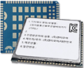
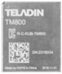

### LTE(Cat M1/5G) 모듈들
아래는 SK텔레콤의 인증을 받은 LTE(Cat M1)/5G 모듈들입니다. 일부 모듈을 제외하고는 대부분은 Qualcomm 사의 칩을 사용했습니다.    
SK텔레콤은 2018년 4월 LTE Cat.M1 전국망 완성을 통해서, IoT 제조사들의 다양한 수요에 대응할 수 있는 네트워크 포트폴리오를 확보하고 IoT 생태계의 기반을 마련하였습니다.    
이를 통해 보안, 유통, 물류, 제조 등의 영역에서 데이터 분석기반 IoT 솔루션 사업의 경쟁력을 확대하여 기존 산업의 디지털 전환(Digital Transformation)을 주도하는 사업자로 성장하였습니다.   
국내 통신사의 IoT 망에 접속하기 위해서는 일부 예외적인 경우를 제외하고는 통신사의 인증을 받은 모듈을 사용해야 합니다.   

|                                             | Model        | 제조사                 | 칩셋        | 구분    |  기타   |
| ---                                         | --- | ---    | ---                    | ---         | ---     | ---     | 
|  | WM-N4XX      | 우리넷                 | MDM9206     | Cat M1  | 2018.09 |
|  | WM-L7XX      | 우리넷                 | MDM9207     | Cat 4   | 2021.01 |
|  | WM-H8XX      | 우리넷                 | SDX62       | 5G      | 2022.11 |
|  | ME910XX      | Telit                  | MDM9206     | Cat M1  | 2018.12 |
|  | ME310XX      | Telit                  | MDM9205     | Cat M1  | 2020.09 |
|  | FN980XX      | Telit                  | SDX55       | 5G      | 2020.07 |
|  | BG96         | 앰투앰넷 (Quectel)     | MDM9206     | Cat M1  | 2019.02 |
|  | RM500        | Quectel                | SDX55       | 5G      | 2021.09 |
|  | BG770        | Quectel                | ALT1250     | Cat M1  | 2022.04 |
|  | AML540XX     | 에이엠텔레콤           | MDM9206     | Cat M1  | 2018.10 |
|  | AML574XX     | 에이엠텔레콤           | MDM9307     | Cat 1/4 | 2018.10 |
|  | EC21         | Quectel                | MDM9307     | Cat 1   | 2017.03 |
|  | EC25         | Quectel                | MDM9207     | Cat 4   | 2017.03 |
|  | TX62-W-B     | Thales                 | MDM9205     | Cat M1  | 2021.04 |
|  | LBAD0XX1SC   | 무라타                 | ALT1250     | Cat M1  | 2021.04 |
|  | MA510-XX     | Fibocom                | MDM9205     | Cat M1  | 2022.02 |
|  | NTLM1610     | 엔티모아               | MDM9206     | Cat M1  | 2018.08 |
|  | NTLM9205     | 엔티모아               | MDM9205     | Cat M1  | 2020.04 |
|  | NTLM9607     | 엔티모아               | MDM9607     | Cat 1/4 | 2020.04 |
|  | SKTL-EM7010S | SK 텔링크              | MDM9205     | Cat M1  | 2021.10 |
|  | SARA-R410M   | 유블럭스               | MDM9206     | Cat M1  | 2019.12 |
|  | TM700        | 텔라딘                 | MDM9207     | Cat 1   | 2019.09 |
|  | TM800        | 텔라딘                 | MDM9206     | Cat M1  | 2019.10 |
|  | SLM156-H     | 플러그정보(MeiG)       | MDM9205     | Cat M1  | 2023.01 |
|  | SLM750-Z     | 플러그정보(MeiG)       | MDM9207     | Cat 1   | 2022.07 |
|  | RC7630       | 시에라와이어리스코리아 | MDM9207     | Cat 4   | 2022.12 |
|  | HM-211S      | 휴컴와이어리스         | MDM9207     | Cat 4   | 2017.02 |

**참고**    
위에 나열된 모듈들 외에도 각 모듈사마다 추가된 Cat M1 모듈들이 있다는 점도 유의하시기 바랍니다.   
{: .notice--primary}

### Cat M1 외장형 모뎀

### 연락처
위에 설명된 Cat M1 모듈 및 외장형 모뎀들에 대해서 **특장점에 대해서 궁금**하시거나 **실물을 확인**해 보고 싶다거나 **제조사 및 판매처의 연락처**를 원하시는 분들은 [openhouse@wiznet.io](mailto:openhouse@wiznet.io)로 연락을 주시기 부탁 드립니다.    

